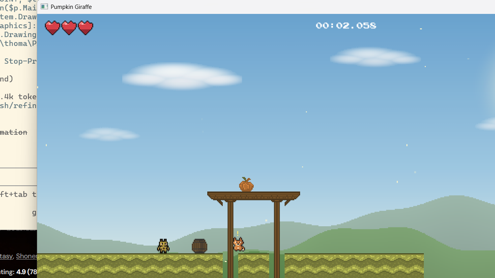

# Pumpkin Giraffe

A tiny speedrunning platformer about a short-necked giraffe, a fistful of pumpkins, and a clock that never stops ticking. Built in Go with [Ebiten](https://ebitengine.org/).



## The point of the game

Grab **5 pumpkins per level, across 4 levels, as fast as humanly possible.**

A timer starts the instant you begin and runs in the top-centre of the screen down to the millisecond (`00:05.030`). It does **not** reset between levels — collect your fifth pumpkin and you're whisked straight to the next map with the clock still ticking. Clear the final level and the game freezes your time and throws up a **"You did it! Your time was MM:SS.mmm"**. That single number is your whole run, start to finish. Beat it. Then beat it again.

Because every pumpkin is mandatory, the route *is* the puzzle: the fastest path that still touches all five, on every map.

Everything is built around shaving frames off that route:

- **Sprint** (hold Shift) multiplies your speed by 2.5×. You'll want it held basically the whole run, but it makes platforms and pits far less forgiving — the classic speedrun trade of control for pace.
- **Moving platforms** slide back and forth on fixed paths. They bridge gaps and lift you to high pumpkins, but they only go as fast as they go — mistime your hop and you wait, or fall. Riding them well is most of the time save on the later maps.
- **Skull enemies** patrol the platforms. Touch one from the side and you die and respawn — a death is a run-killer. Land on their heads, though, and you stomp them and bounce.
- **Pumpkins** are the goal, not a detour: five per level, scattered on ground, ledges, and out over the void where only a platform ride will reach them.

## The four levels

The original map first, then three new ones on a gentle difficulty ramp:

1. **Pumpkin Patch** — the original level.
2. **Rolling Start** — gentle intro: mostly solid ground, two slow platforms bridging small gaps.
3. **Gap Gauntlet** — more gaps, a vertical lift, a torii staircase, pumpkins that need a platform ride.
4. **Skyline Sprint** — sparse ground, fast platforms, pumpkins out over the void and up on the high torii.

## Controls

| Action | Keys |
|---|---|
| Move left / right | `A` / `D` or `←` / `→` |
| Sprint (2.5× speed) | hold `Shift` |
| Jump | `Space` or `↑` |
| Interact (barrels etc.) | `E` |
| Quit | `Esc` |

## Run it

Grab the latest build, or build it yourself — it's a single self-contained binary with every sprite, sound, and the music baked in (no loose asset files to ship).

```bash
git clone https://github.com/TRob9/pumpkin-giraffe.git
cd pumpkin-giraffe
go build -o pumpkin-giraffe .
./pumpkin-giraffe        # Windows: .\pumpkin-giraffe.exe
```

You'll need [Go](https://go.dev/dl/) 1.24 or newer. The first build downloads Ebiten and its dependencies automatically.

## A note on the giraffe

He has a short neck. Yes, on purpose. A giraffe who can't reach the high leaves has to be good at *something* — so he jumps.

## Tech

- **Language:** Go (1.24+)
- **Engine:** [Ebiten](https://ebitengine.org/) v2 — pure-Go 2D game library
- **Assets:** embedded into the binary via Go's `//go:embed`, so the exe runs anywhere with nothing alongside it
- **Resolution:** 1280×720 logical, scaled to the window

---

*A hobby project. Pull requests and faster times both welcome.*
